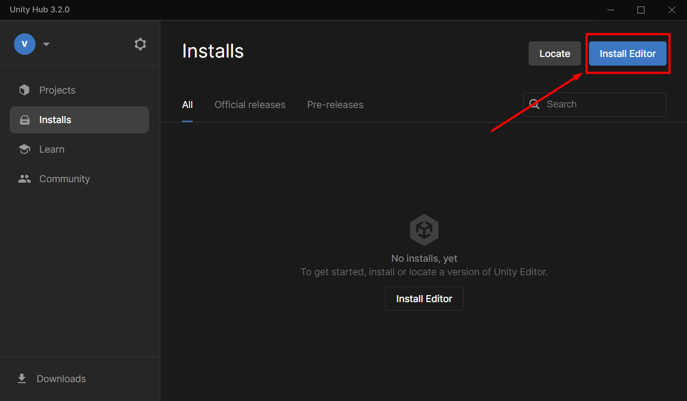
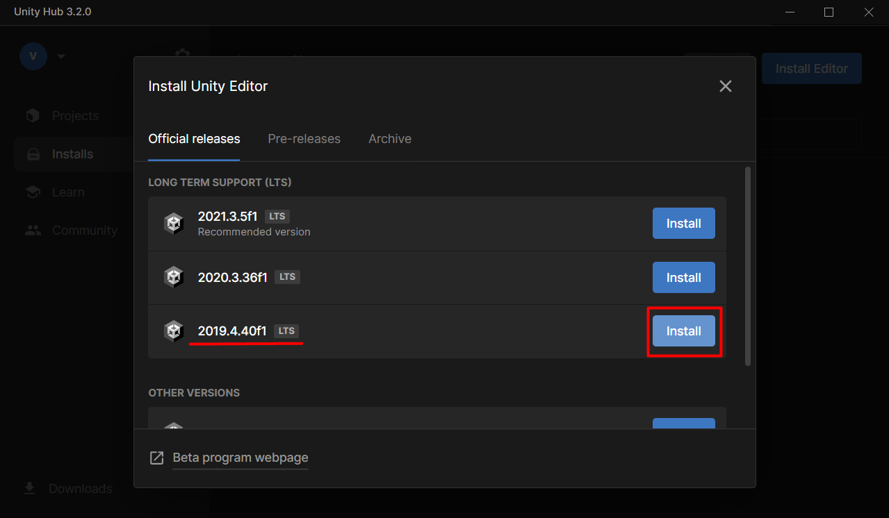
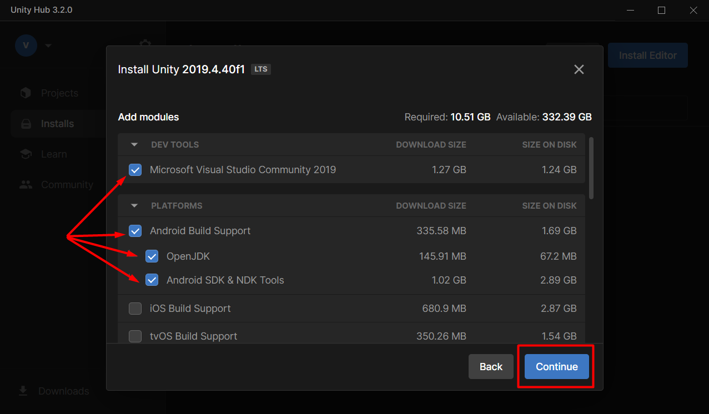

# **Installing required software components to use Finch Unity SDK v1.0.1** 

[<- Go back](../README.md) 

To use Finch Unity SDK you need to install the required software components (Unity 2019).

1. Download, install and launch [Unity Hub](https://unity3d.com/get-unity/download).
2. Open Unity Hub, click **Installs** and launch **Install Editor**.

3. Select Unity **2019.4.40f1 (LTS)** or newer patch of Unity **2019.4** only (i.e. Unity 2019.4.хххх) and click **Install**.

4. Select **Microsoft Visual Studio Community 2019** and **Android Build Support**, click Continue.

5. Wait for the installation process to finish.