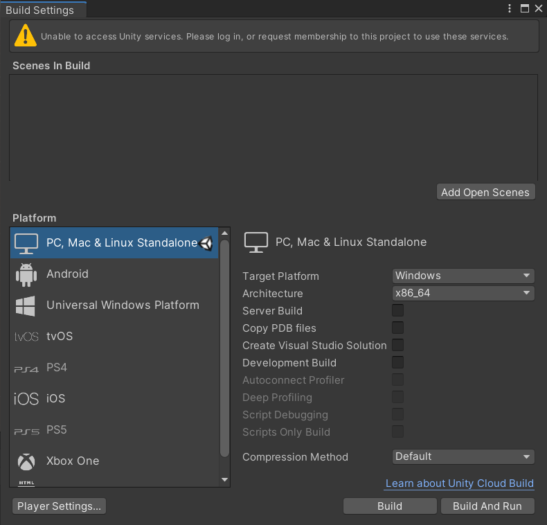
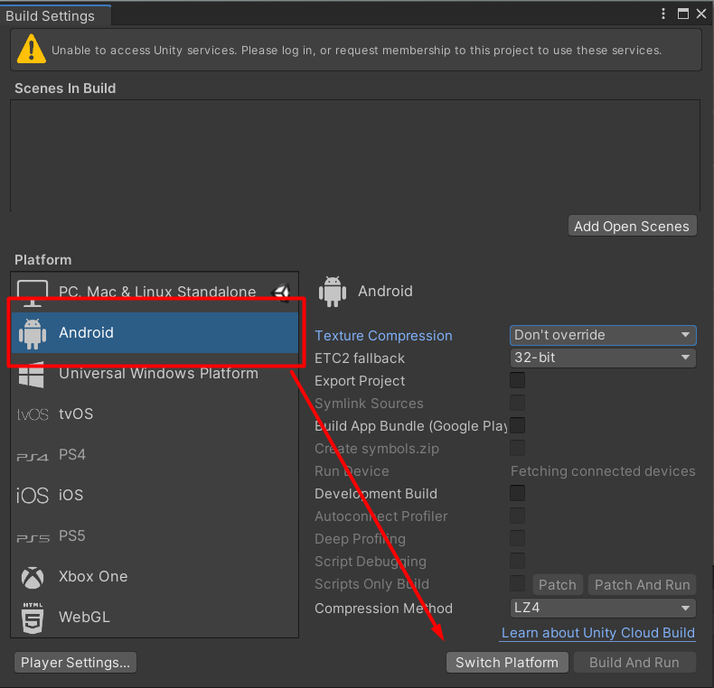
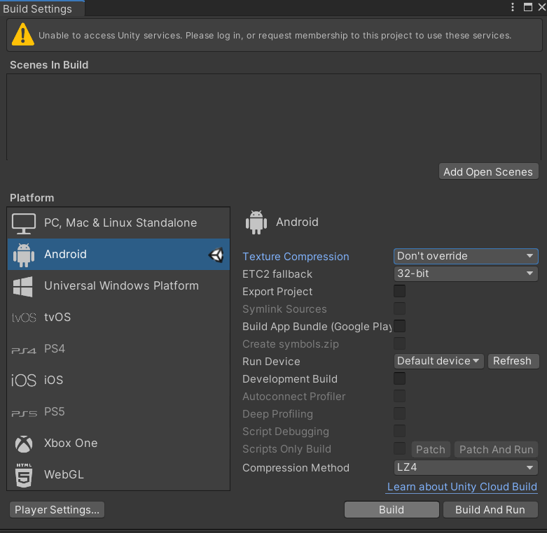

# **Android Build creation on PC**

[<- Go back](../README.md) 

To build your project open Build settings at ```File/Build Settings...```



Switch platform to Android



After the project is switched to Android, click the Build button.



After the build is completed, the folder with the assembled apk-file will open. You can install this apk-file on an android device.