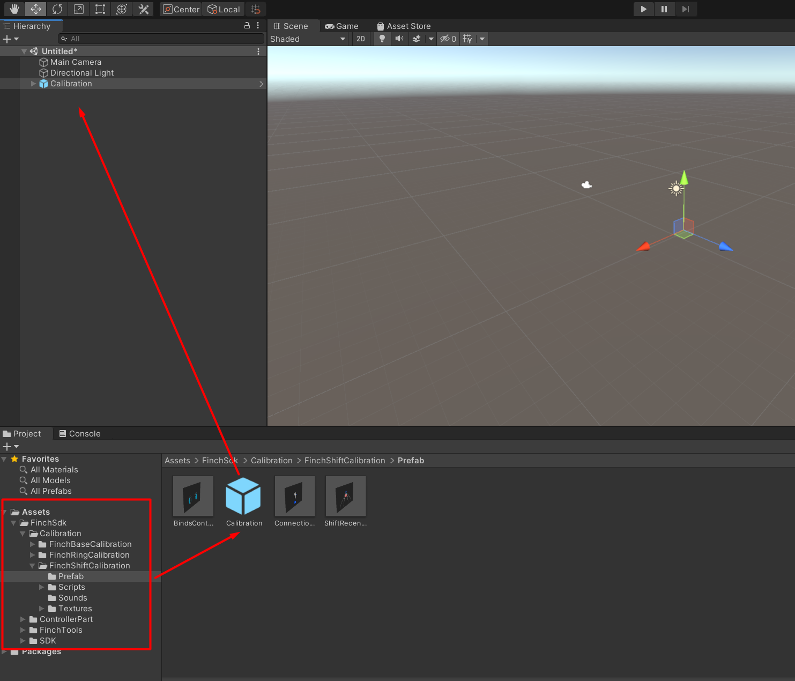

# **Custom Scene Set Up by using "Finch Unity SDK v1.0.1" in Unity**

[<- Go back](../README.md) 

Some recommendations to set up custom scene by using "Finch Unity SDK v1.0.1" in Unity.   

1. Open Unity Hub and press the **Open** button

2. Select the folder with the Unity SDK project and open it.

3. Drag and drop the “Calibration” prefab to the Hierarchy window. 

4. Drag and drop the “**LeftShiftController**” and “**RightShiftController**” prefabs to the Hierarchy window.

5. Press the right button in the Hierarchy window and press “Create Empty” to create a new GameObject.  
Add the “**Finch Manager**” component.  
Choose the “**Shift**” Controller Type.  
Drag and drop the “**Main camera**” scene to the Head.  

6. In the “Calibration” prefab for each prefab included (**ConnectionSet**, **BindsControllerStep** and **ShiftRecenterStep**) add “Main camera” to the follower script (“Object to follow”):

## “Follower” is not needed unless you want the calibration steps to follow the direction of gaze.

