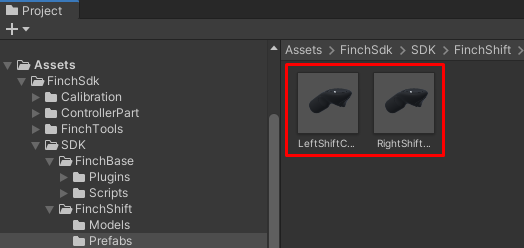
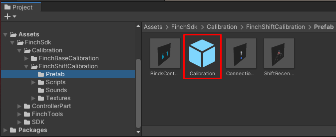
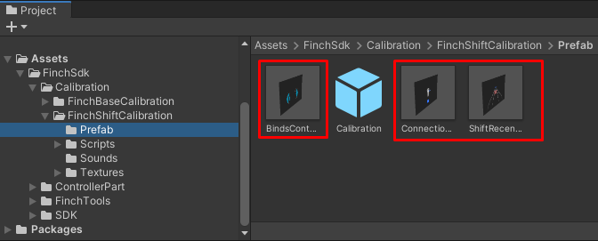

# **Description of prefabs in Finch Unity SDK v1.0.1** 

[<- Go back](../README.md) 

Left Shift Controller and Right Shift Controller these are the prefabs of the left and right controllers, respectively. They have models of Shift controllers and are configured to display all the button presses of the real controller and its movements.

The Calibration prefab contains the minimum required components to successfully calibrate Finch Shift controllers.

Calibration step prefabs are used by the Calibration prefab. Each of them is responsible for a certain stage of calibration - connection, chirality bind and receiver.

