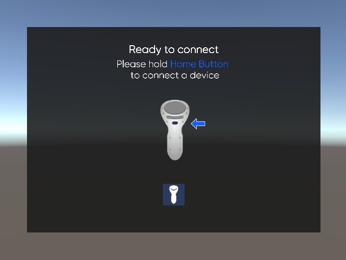
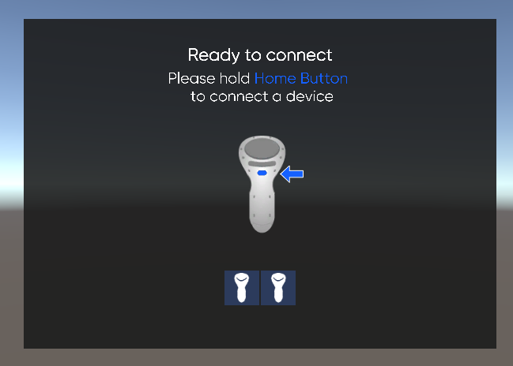
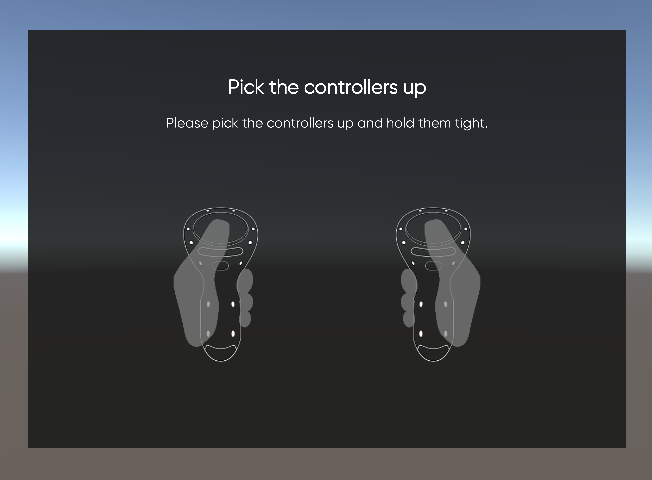
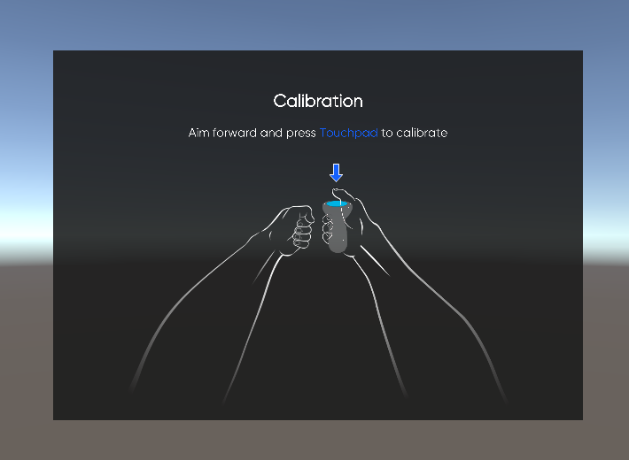
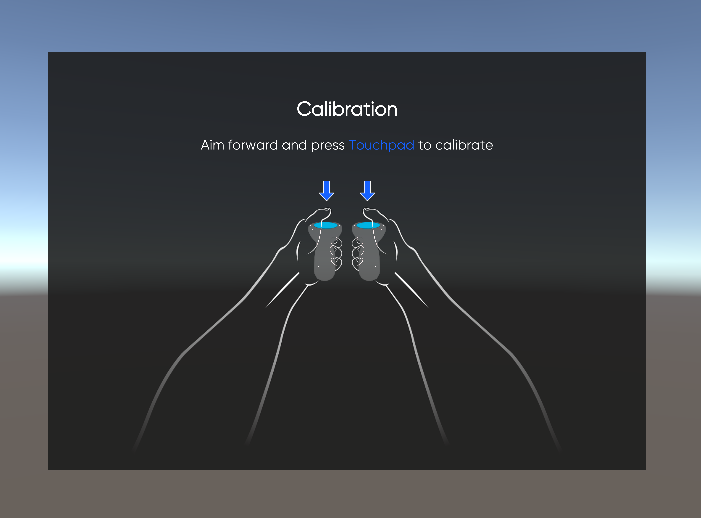

# **FinchShift connection and calibration** 

[<- Go back](../README.md) 

## Connection

In the SDK there is a process of connection and calibration of FinchShift controllers.  
The connection overlay will appear every time you launch the app. Go through the connection process - wait until all devices are automatically connected*.

Press and hold the Home Button to connect a device. If you use only one FinchShift controller, you'll see the overlay with one controller on it:   

If you use a set of two FinchShift controllers, you'll see the overlay with two controllers on it. Press the Home buttons in turn on each controller one by one until you see the blue indication in each device’s interface:   

The next step is to bind chirality - each of the controllers must understand whether it is intended for the Right or for the Left hand. Hold the controller as it is described on the overlay:  

## Calibration

After the controllers are connected you will see a Finch calibration overlay. Follow the steps on the overlay.  
In the current version of the software package, IMU calibration is used. That means you should straighten your arms in front of you and keep the controller parallel to the ground and press the Touchpad:  

When using two FinchShift controllers press the Touchpad in turn on each controller one by one:

To recalibrate (or in case of disconnection) press and hold the Home button. 

---

*If you are not able to connect controllers - try the following:  
- Make sure you have only one set of FinchShift controllers (2 devices) turned on near the headset;  
- Make sure the Bluetooth is on;  
- Delete all Finch devices and unnecessary devices from the Bluetooth list if there are any;  
- Connect controllers manually in the Bluetooth settings then go back to your app and try to connect controllers again.
